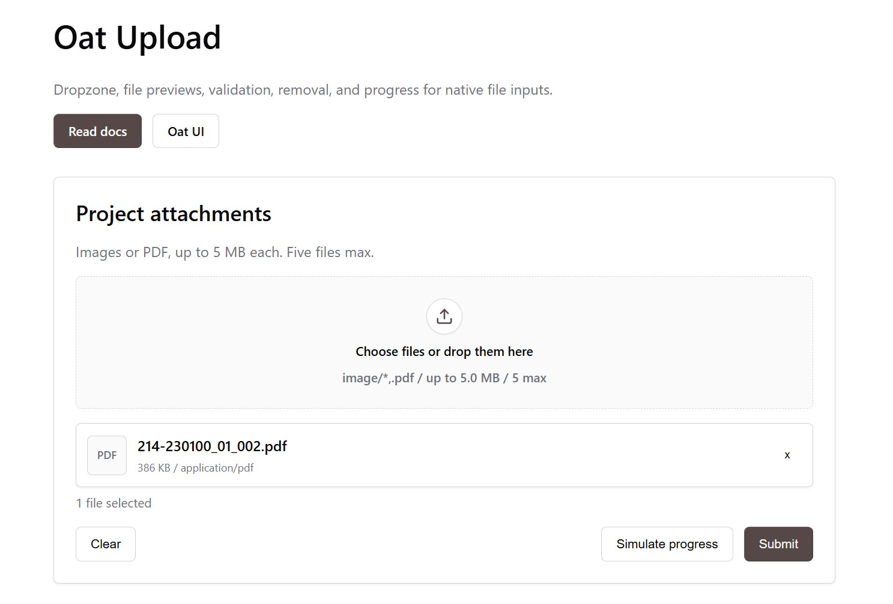

# Oat Upload

[](LICENSE)
[](https://www.npmjs.com/package/@globus.studio/oat-upload)

> Dropzone, file previews, validation, removal, and progress for native `<input type="file">` in [Oat UI](https://github.com/knadh/oat).

Oat Upload is a small, zero-runtime-dependency extension for Oat. It keeps the native file input as the source of truth and adds progressive behavior around it:

- drag and drop over a semantic file input
- image and file previews
- remove selected files before submit
- size, type, and count validation
- progress via native `<progress>`
- form-friendly file syncing where the browser supports `DataTransfer`
- events for app code: `ot-upload-change` and `ot-upload-error`

Without JavaScript, users still get a regular `<input type="file">`. With JavaScript, `<ot-upload>` builds the richer upload surface.



## Install

With npm:

```bash
npm install @globus.studio/oat-upload
```

```js
import '@globus.studio/oat-upload/css';
import '@globus.studio/oat-upload';
```

From a CDN:

```html
<link rel="stylesheet" href="https://oat.ink/oat.min.css">
<link rel="stylesheet" href="https://unpkg.com/@globus.studio/oat-upload@0.1.1/dist/oat-upload.min.css">
<script src="https://oat.ink/oat.min.js" defer></script>
<script src="https://unpkg.com/@globus.studio/oat-upload@0.1.1/dist/oat-upload.min.js" defer></script>
```

## Basic Usage

```html
<ot-upload max-size="5242880" max-files="5">
  <input type="file" name="attachments" multiple accept="image/*,.pdf">
</ot-upload>
```

That is enough. Oat Upload creates the dropzone, preview list, status output, and progress element.

## Custom Markup

Use `data-upload-*` parts when you want to control the HTML.

```html
<ot-upload max-size="5242880" max-files="3">
  <input id="files" type="file" name="files" multiple accept="image/*,.pdf">

  <label data-upload-dropzone for="files">
    <strong>Drop files here</strong>
    <small class="text-light">Images or PDF, up to 5 MB each.</small>
  </label>

  <output data-upload-error role="status" aria-live="polite"></output>
  <ul data-upload-list aria-label="Selected files"></ul>
  <progress data-upload-progress max="100" value="0" hidden></progress>
  <output data-upload-status aria-live="polite"></output>
</ot-upload>
```

## Validation

Validation reads from the native input first, then from `<ot-upload>` attributes.

```html
<ot-upload accept="image/*,.pdf" max-size="5242880" max-files="5">
  <input type="file" multiple>
</ot-upload>
```

| Attribute | Element | Description |
| --------- | ------- | ----------- |
| `accept` | `input`, `ot-upload` | Comma-separated extensions or MIME types. Supports `image/*`. |
| `max-size` | `ot-upload` | Max bytes per file. |
| `max-files` | `ot-upload` | Max accepted files. |
| `multiple` | `input` | Allows more than one file. Without it, new selection replaces the previous file. |
| `disabled` | `input`, `ot-upload` | Disables drop and picker behavior. |

Rejected files trigger `ot-upload-error` and are not added to the selected list.

## Progress

Use the native progress element generated by the component or provide your own with `data-upload-progress`.

```js
const upload = document.querySelector('ot-upload');

upload.setProgress(0);
upload.setProgress(65);
upload.setProgress(100);
```

Passing `null` or calling `resetProgress()` hides the progress element.

```js
upload.resetProgress();
```

## Events

```js
const upload = document.querySelector('ot-upload');

upload.addEventListener('ot-upload-change', (event) => {
  console.log(event.detail.files);
  console.log(event.detail.added);
  console.log(event.detail.removed);
});

upload.addEventListener('ot-upload-error', (event) => {
  console.log(event.detail.reason);
  console.log(event.detail.message);
});
```

`ot-upload-change` detail:

| Property | Description |
| -------- | ----------- |
| `files` | Current accepted files. |
| `added` | Files added by the current operation. |
| `removed` | Files removed by the current operation. |
| `rejected` | Rejected files from the current operation. |

`ot-upload-error` detail:

| Property | Description |
| -------- | ----------- |
| `file` | Rejected file, when available. |
| `reason` | `type`, `size`, `count`, or `disabled`. |
| `message` | Human-readable message. |

## API

```js
const upload = document.querySelector('ot-upload');

upload.files;              // accepted files
upload.addFiles(files);    // FileList or File[]
upload.remove(fileOrId);   // File, item id, or index
upload.clear();            // remove all files
upload.setProgress(42);    // update native progress
upload.resetProgress();    // hide progress
```

## Development

```bash
npm install
npm run check
```

`npm run check` builds `dist/` and runs the DOM test suite.

## Publishing

```bash
npm run check
npm publish --dry-run
npm publish
```

The package is configured for public scoped npm publishing with `publishConfig.access`.

## License

MIT.
